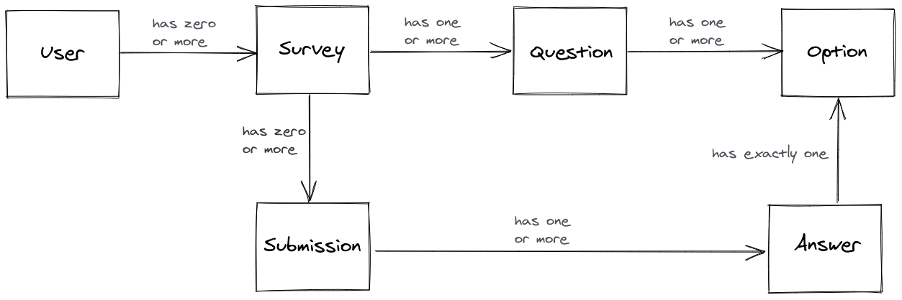
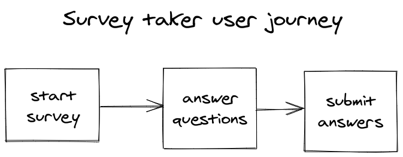

# Survey app

A basic survey web app written in Django with no JavaScript. Read more about how it was written in this [accompanying blog post](https://mattsegal.dev/django-survey-project.html)

This is a website where users can create surveys and get answers to their questions. A user can sign up, create a survey, add questions to the survey, and then send a link to other people. When the survey is complete, the user can see what percentage of people answered each question.


# Setup

Requires Python 3 and the pip package manager.

```bash
# Optional - create virtualenv
virtualenv env
. env/bin/activate
# Install requirements
pip install -r requirements.txt
# Setup database
./manage.py migrate
./manage.py createsuperuser
./manage.py runserver
```

# Data model

The app uses, roughly, the following data model:



# User journeys

There are two main user journeys, one for the users creating the surveys and another for the users taking the surveys.




# Wireframes

Wireframes of each page can be found in [here](docs/wireframes)
